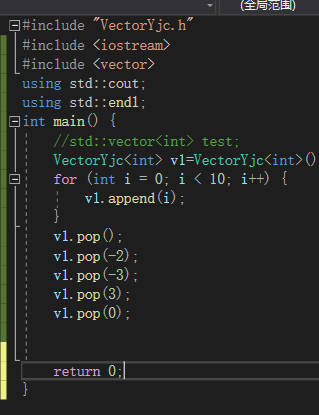
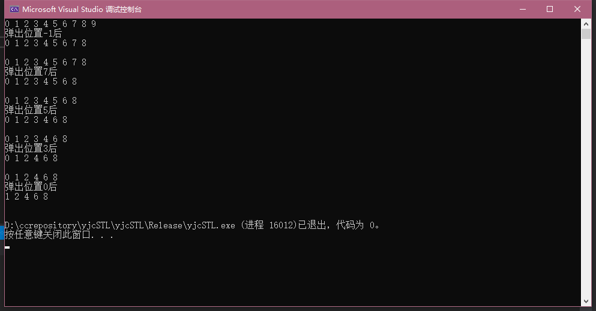

# yjc-tinySTL
自己写STL 合理吗? 这合理嘛

    

## 简介

 基于 `C++11` 的 `tinySTL`，这是我的第一个stl项目，难免会有很多丑陋的地方,别人的stl我也看不懂 所还能自己来了

## 更新

- 2021年4月20日00:29:09 第一次提交
    - 正在重写vector 用的是python List 的思想

## 支持

* 操作系统
    * linux
    * windows
* 编译环境
    * visual studio 2019 c++桌面

## 运行

